# Microsoft Endpoint Administration Home Lab

Hands-on lab focused on Windows administration, Microsoft Entra ID, identity and access management, PowerShell, troubleshooting, security, and endpoint administration.

## Lab Environment

- Windows 11 ARM virtual machine
- UTM virtualization on macOS
- Microsoft Entra ID
- Microsoft 365
- Microsoft Authenticator
- PowerShell

## Skills Demonstrated
- Windows 11 administration
- Local user and group management
- Password resets and account lockout troubleshooting
- Event Viewer and Windows Security logs
- Windows services and Device Manager
- PowerShell administration
- Network and DNS troubleshooting
- Group Policy and Local Security Policy
- Software installation and removal
- Microsoft Entra ID user and group administration
- Multi-Factor Authentication
- Microsoft Authenticator
- Sign-in and audit log investigation
- Session revocation
- Account enable/disable and recovery
- RBAC and least-privilege administration
- Microsoft Intune device enrollment
- Mobile Device Management (MDM)
- Intune Settings Catalog configuration profiles
- Windows compliance policies
- Microsoft Store application deployment
- Windows Update Rings
- Microsoft Defender Antivirus policy management
- Intune device and user troubleshooting
- Endpoint compliance and deployment reporting

## Lab Projects

### 01 - Windows User Administration
Created and managed local Windows users and groups, performed password resets, and tested account access.

### 02 - PowerShell Administration
Used PowerShell for Windows administration, system inspection, and troubleshooting.

### 03 - Account Lockout Troubleshooting
Created controlled authentication failures and used Windows logs to investigate failed sign-ins and account lockouts.

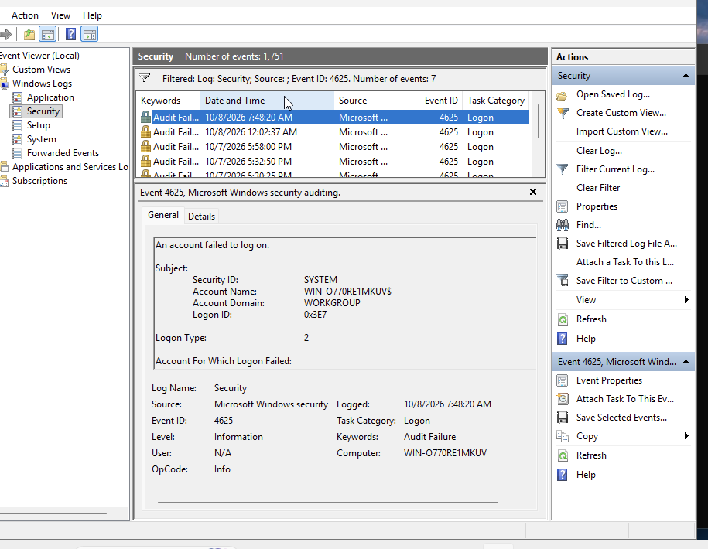

*Verified failed authentication activity in the Windows Security log using Event ID 4625.*

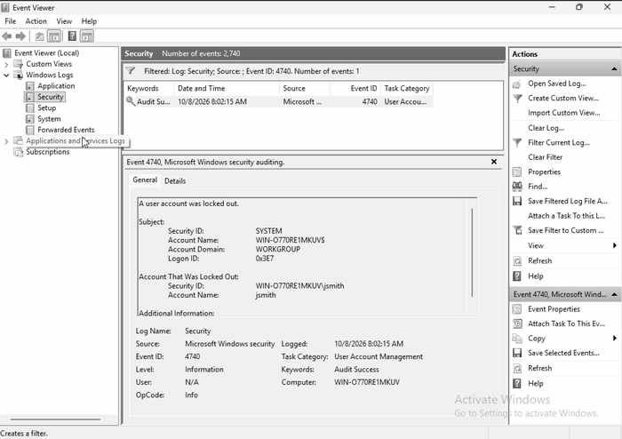

*Verified the locked account in the Windows Security log using Event ID 4740.*

### 04 - Event Viewer and Security Logs
Reviewed Windows Event Viewer and Security logs to identify authentication and account-related events.

### 05 - Network Troubleshooting
Used PowerShell tools to inspect network adapters, IP configuration, connectivity, and DNS resolution.

### 06 - Group Policy and Local Security Policy
Configured and tested Windows security and policy settings in a lab environment.

### 07 - Software Management
Installed, verified, and removed software as part of endpoint lifecycle testing.

### 08 - Microsoft Entra ID Administration
Created cloud users and security groups and managed group membership.

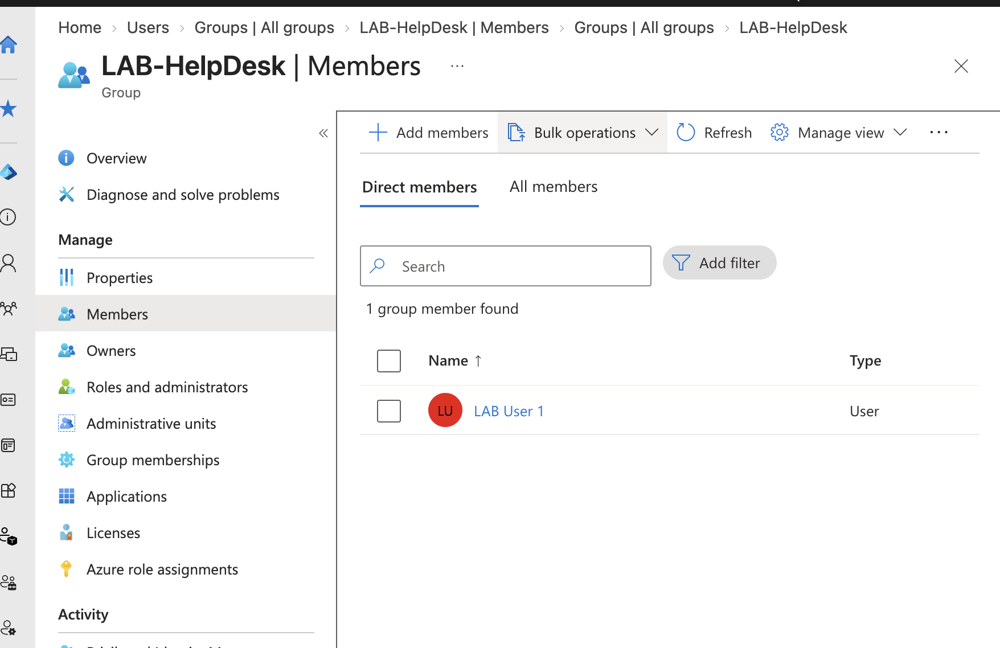

*Verified LAB User 1 as a direct member of the LAB-HelpDesk security group.*

### 09 - MFA and Authentication
Configured MFA with Microsoft Authenticator and tested authentication workflows.

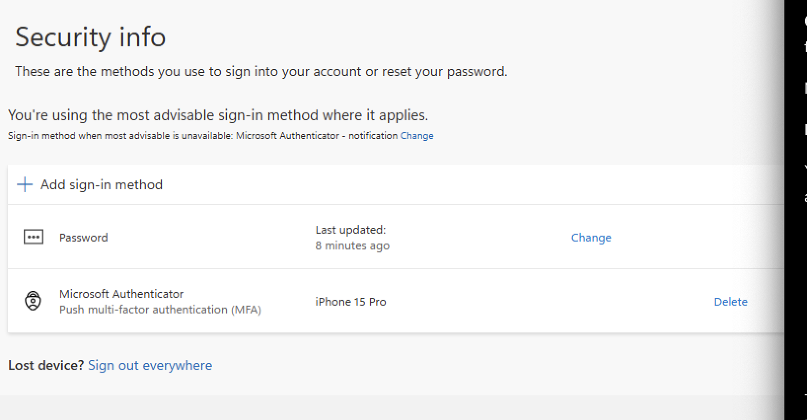

*Verified Microsoft Authenticator as a registered push-based multi-factor authentication method.*

### 10 - Sign-in and Audit Logs
Reviewed Microsoft Entra sign-in and audit logs to investigate authentication activity.

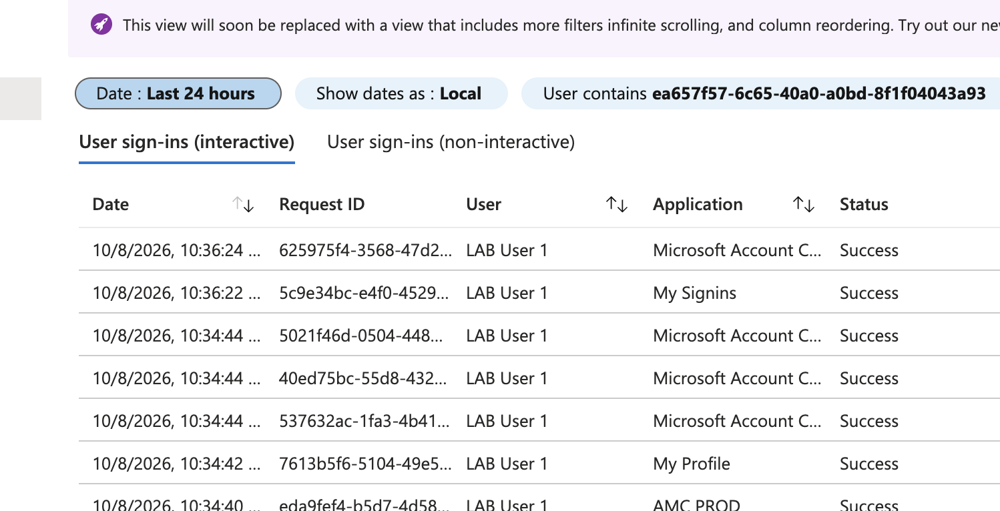

*Reviewed interactive sign-in activity to verify successful authentication and investigate sign-in behavior.*

### 11 - Password Reset and Session Revocation
Reset cloud-user passwords, forced password changes, revoked active sessions, and verified reauthentication.

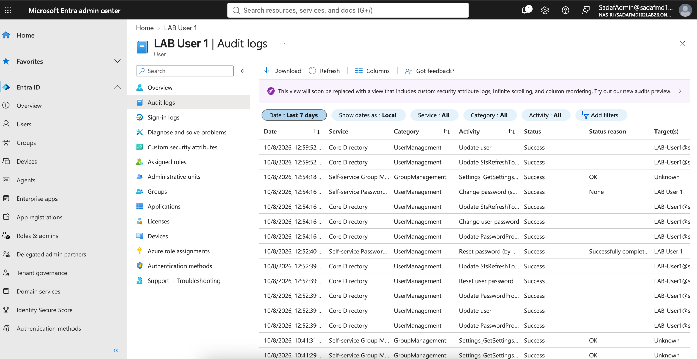

*Used Entra audit logs to verify password-reset, password-change, and session-related administrative activity.*

### 12 - Account Access Recovery
Disabled a user account, reproduced the access failure, re-enabled the account, and verified successful recovery.

### 13 - RBAC and Least Privilege
Assigned a temporary Helpdesk Administrator role, tested administrative access, and removed the role after validation.

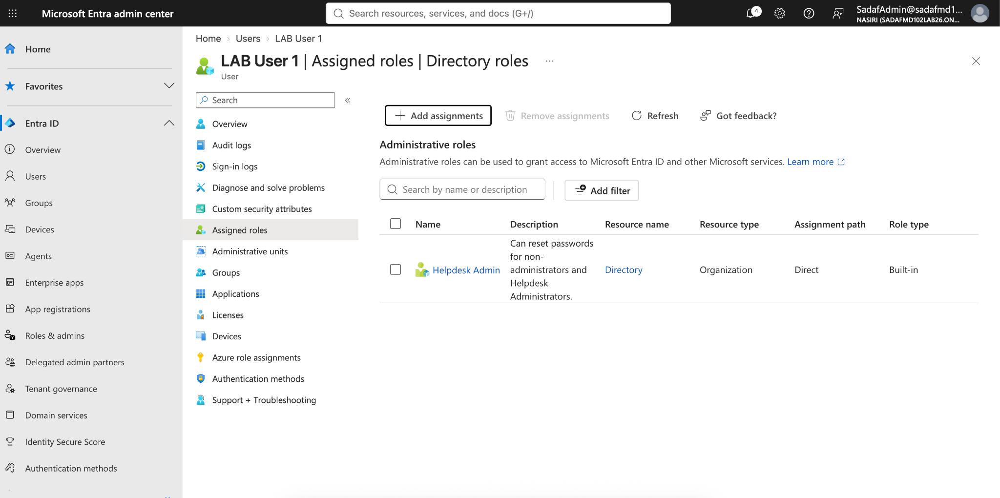

*Temporarily assigned the Helpdesk Administrator role to test delegated administrative access.*

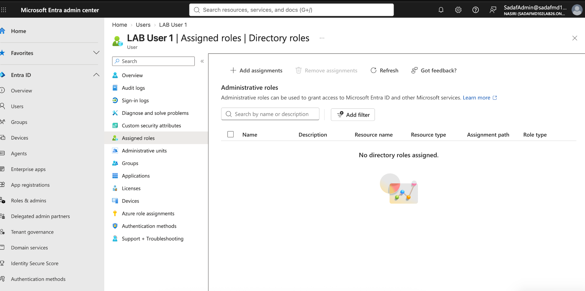

*Removed the privileged role after testing and verified that no directory roles remained assigned.*

## Microsoft Intune Endpoint Administration

Completed hands-on Microsoft Intune administration using the Windows 11 lab endpoint `DEPLOY-01`.

### 14 - Windows Device Enrollment
Enrolled `DEPLOY-01` into Microsoft Intune and verified the endpoint was actively managed.

Key tasks:
- Connected the lab work account to Windows
- Enabled automatic MDM enrollment
- Verified Intune management status
- Confirmed device inventory and compliance reporting

### 15 - Configuration Profile Deployment
Created and deployed a device-targeted Settings Catalog policy to `DEPLOY-01`.

Configured:
- Camera access disabled through Intune
- Policy assigned to managed devices
- Device sync initiated manually
- Deployment verified successfully in Intune reporting

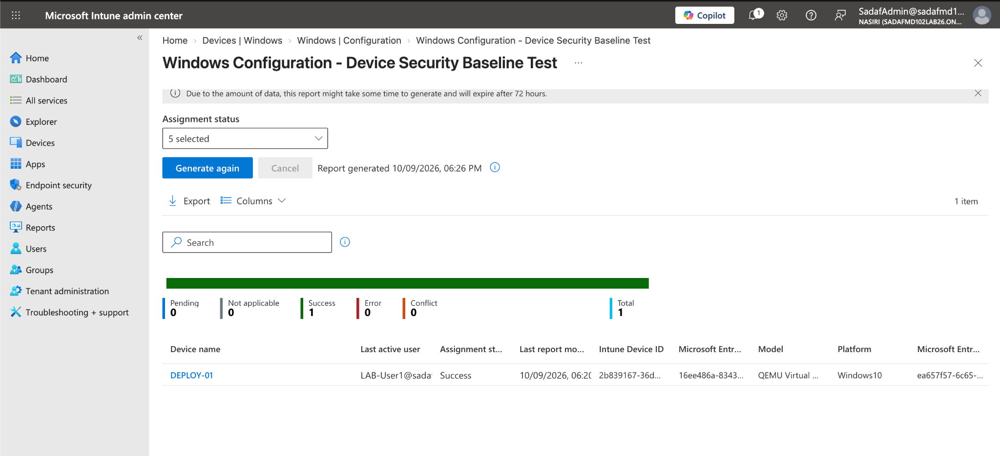

*Verified the device-targeted configuration profile successfully applied to DEPLOY-01 with no errors or conflicts.*

### 16 - Device Compliance
Created a Windows compliance policy to evaluate endpoint security requirements.

Configured:
- Password requirement
- Simple password restriction
- Minimum password length
- Immediate noncompliance evaluation

Verified `DEPLOY-01` reported as compliant in Microsoft Intune.

*Verification: `DEPLOY-01` reported Compliant in Microsoft Intune during the lab. The dedicated policy screenshot was not retained.*

### 17 - Application Deployment
Deployed Microsoft Company Portal through Intune using the Microsoft Store app deployment workflow.

Configured:
- Install behavior: System
- Required assignment to managed devices
- Manual device synchronization

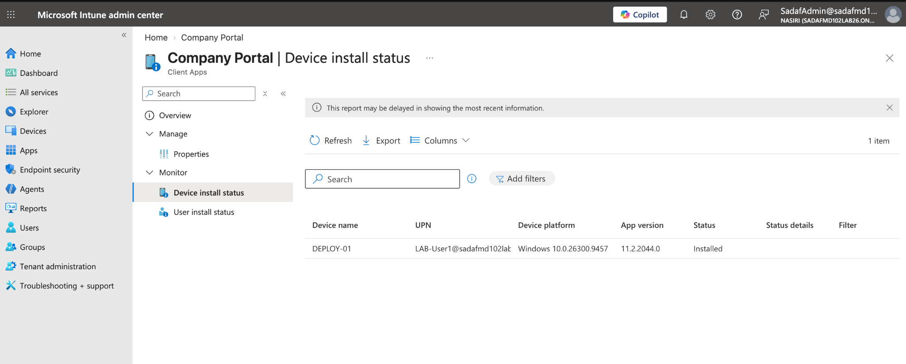

*Verified Company Portal installed successfully on DEPLOY-01 through Intune.*

### 18 - Windows Update Management
Created and deployed a Windows Update Ring.

Configured:
- Microsoft product updates allowed
- Windows driver updates allowed
- Quality update deferral: 0 days
- Feature update deferral: 7 days
- Active hours: 8 AM–5 PM
- Automatic installation during maintenance time

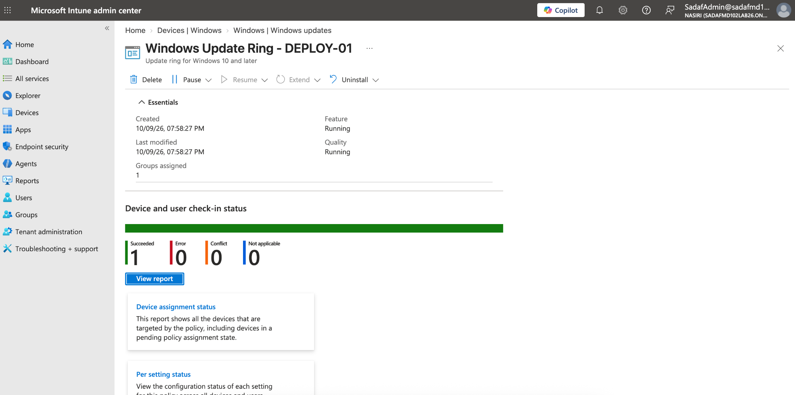

*Verified the Windows Update Ring successfully applied to DEPLOY-01.*

### 19 - Endpoint Security
Created and deployed a Microsoft Defender Antivirus policy.

Configured:
- Cloud protection
- Real-time monitoring
- Automatic safe sample submission
- Potentially unwanted application protection

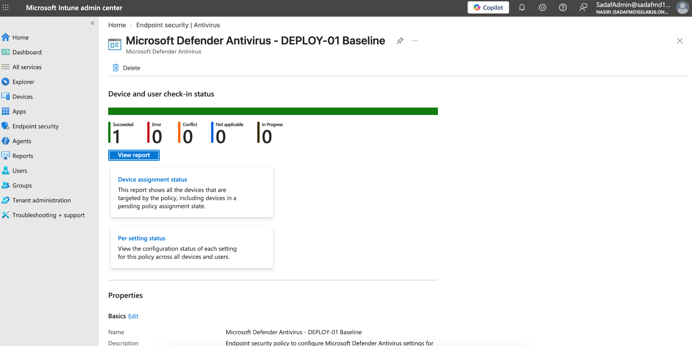

*Verified the Defender Antivirus policy successfully applied with no errors or conflicts.*

### 20 - Intune Troubleshooting and Reporting
Used Intune Troubleshooting + Support to investigate user and endpoint health.

Verified:
- LAB User 1 was enabled and Intune licensed
- DEPLOY-01 was actively managed by Intune
- Intune compliance: Compliant
- Microsoft Entra compliance: Compliant
- Application lifecycle status: Success

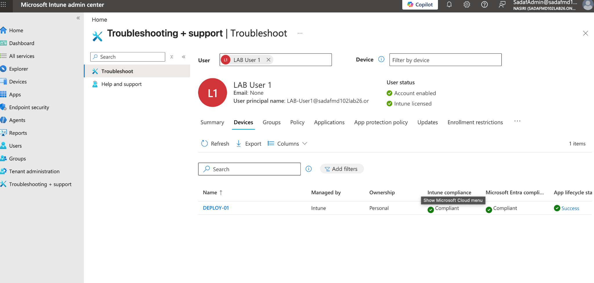

*Used Intune troubleshooting reports to verify endpoint compliance, management status, and application health.*

## Objective

Build practical hands-on experience in Microsoft endpoint administration, identity and access management, security, and troubleshooting using Windows, Microsoft Entra ID, PowerShell, and Intune while preparing for MD-102 and future cloud administration roles.
